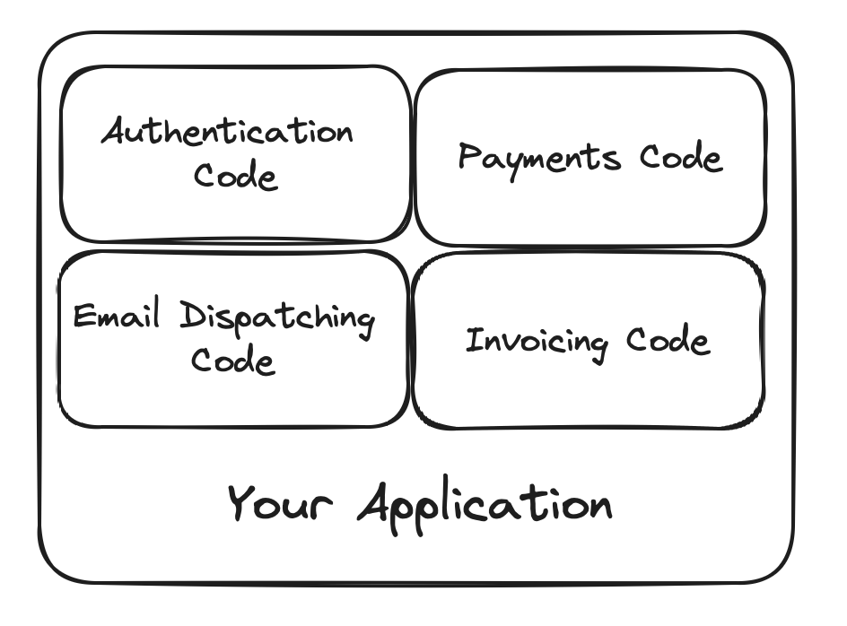
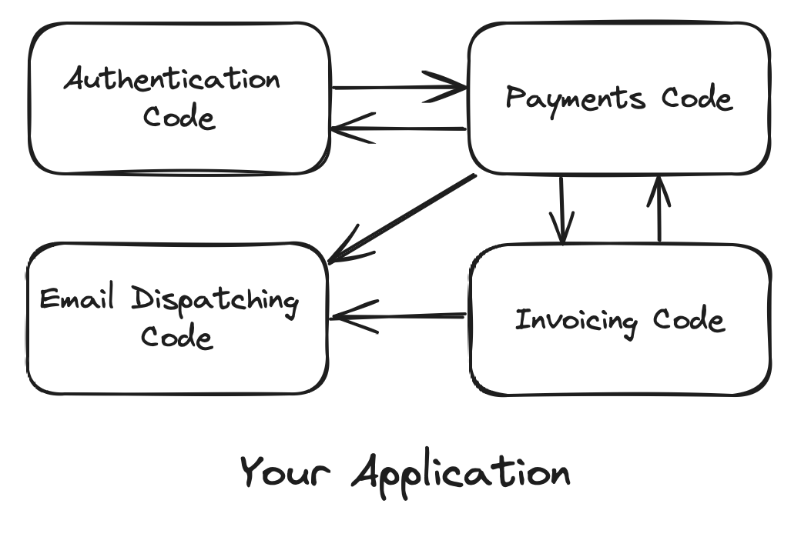
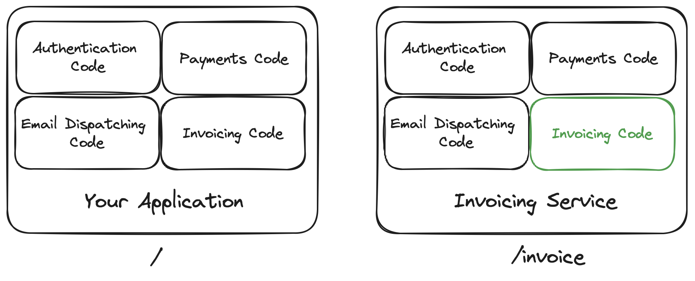
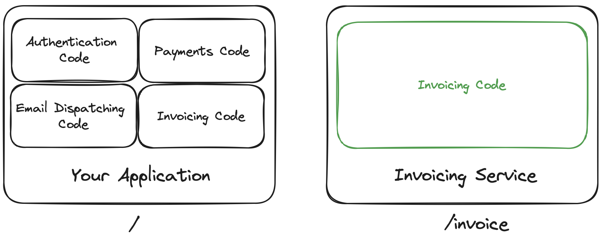
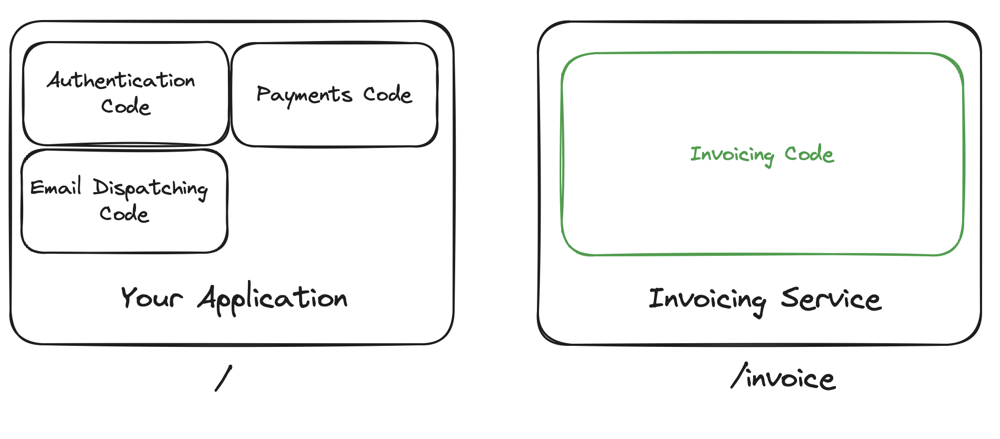

## Preface

The technological benefits of Monoliths is a widely covered topic in the technology community,
however, the benefits for an organisation/business are less discussed.
This post aims to bridge that gap.

## What is a Monolithic Application?

A monolith is a single-tiered software application where different components are combined into
a single program from a single platform. This usually leads to deeply coupled code making it harder
for individual teams to work in their own independent software development life cycles (SDLCs).

## What is Mini-Monolith / Microservice Applications?

Mini-monolith or microservice applications are composed of small, independent modules that work together
to form a complete platform. Each module can be developed, deployed, and maintained independently, with its 
own dedicated team and development pipeline. This independence allows for more flexibility and scalability in
the software development process.

## Why are Monoliths important?
Monoliths offer simplicity and straightforward development and deployment processes,
making them initially appealing for businesses. They allow for great velocity when working on small scale projects
as well as easy deployments strategies - both facilitating the ability to go to market faster.

## Why move to Mini-Monolith / Microservices? 

### Deployment Blockers
Microservices reduce deployment blockers as each service is deployed independently. This means updates or 
fixes in one area don't hold up the entire application's deployment process. Many companies completely automate this
process, allowing for a much faster, leaner release cycles in comparison to batch feature releases.

### Feature Branch Releases
Adopting feature branching in a microservices architecture allows for each feature to be developed and released 
sequentially, rather than in batched updates. This approach offers several advantages. Firstly, it enables faster 
rollbacks in case of issues, as only the specific feature branch is affected. Secondly, it facilitates more focused 
testing and quality assurance, since each feature is isolated. This method also accelerates the feedback loop from 
users, as features are released incrementally. Moreover, it reduces the risk of conflicts between different development 
efforts, leading to a smoother and more efficient release process. Feature branching thus enhances the overall agility 
and responsiveness of the development cycle.

### Team Growth
Microservices support team growth by allowing new team members to focus on specific areas without needing to
understand the entire codebase. This specialization accelerates onboarding and productivity.

### Team Communication and Transparency
Implementing a platform like Slack in a microservices environment enhances team communication and transparency. 
A dedicated Slack channel for each microservice team creates a centralized communication hub,
facilitating real-time updates, cross-departmental collaboration, and a transparent decision-making process. 
This setup is particularly beneficial for distributed teams, promoting an inclusive culture and efficient
problem-solving. By leveraging Slack, teams can maintain a continuous flow of information, ensuring everyone is 
aligned and informed, which is crucial in a fast-paced development environment.

### Domain Experts
Teams can develop deep expertise in their specific service area, leading to higher quality outputs. 
Collaboration is enhanced as teams share their specialized knowledge across the organization.

### Faster time to market 
Teams can develop, test, and deploy their services independently, leading to faster overall development cycles.
This independence speeds up innovation and response to market changes. This is especially important when you consider 
the automation provided by modern CI/CD pipelines with the ability for releases to not be blocked, as could be the case
in a Monolithic deployment.

### Team Autonomy 
Each team has control over their microservice, from development to deployment, fostering a sense of ownership and
accountability, which often leads to better quality and innovation. 

### Faster Releases
With smaller, independent units of code, releases can happen more frequently and with less risk, allowing the
business to deliver new features and fixes to customers faster. Tests can also be focused to the specific domain
of the application, allowing unit tests to be written, maintained and tested by the specific domain experts.

### Happier Customers
The combination of faster releases, better quality, and quick issue resolution often leads to improved customer
satisfaction, as customers benefit from a more responsive and continuously improving product.

## How do I migrate? 

The easiest and most tangible way to quickly migrate a monolithic application to microservice / mini-monolith would
be a divide and conquer strategy. This is where we find specific domains that our application fulfills and partition /
break them out one by one.

In this example we want to create a new microservice for the `invoice` system.
We can do this quickly by duplicating our original application code into a new repository and then deploying this 
as a new instance. At this point we have two identical instances deployed. In this example When requests are made
for `/invoice` we simply route the request to the invoice service.

A new team would then take ownership of the `invoice` code (as it has been split out into its own repository), allowing 
them to trim down the application code to ensure its domain specific (only related to invoicing).

In a real production environment you would manage the switch for `/invoice` routing to the invoice service via a
feature flag. This ensures there is 0 downtime for the system. This also makes it possible to fall back to the original
system 'on the fly' if something was to go wrong during the refactor. 

Once the refactor is complete and thoroughly tested, the original code found in the main application can be removed.

## Wrapping Up

Microservices and Mini-Monoliths offer significant benefits when implemented well, but they're not a universal solution
for every business. I hope this overview was helpful in understanding their potential advantages for your organization.