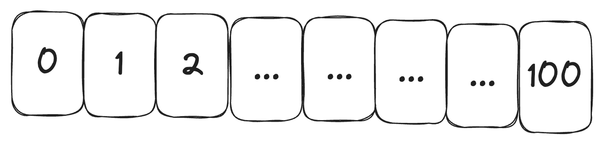
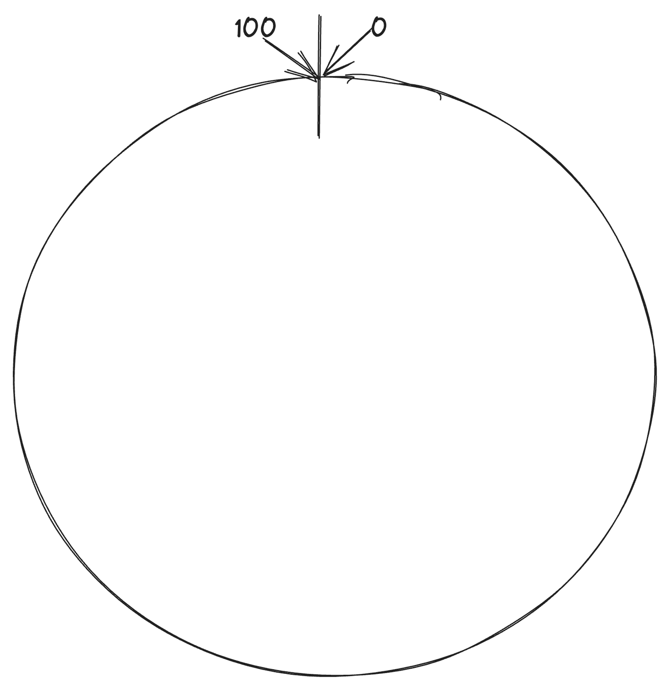
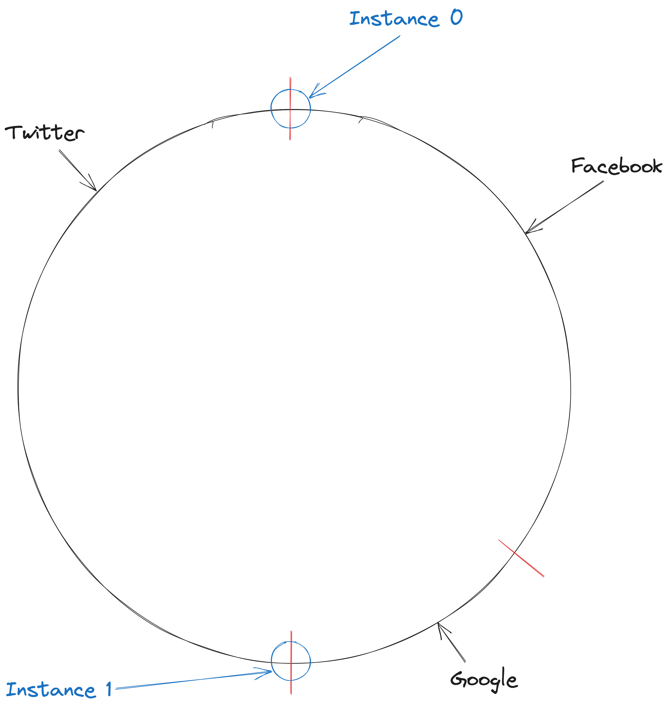
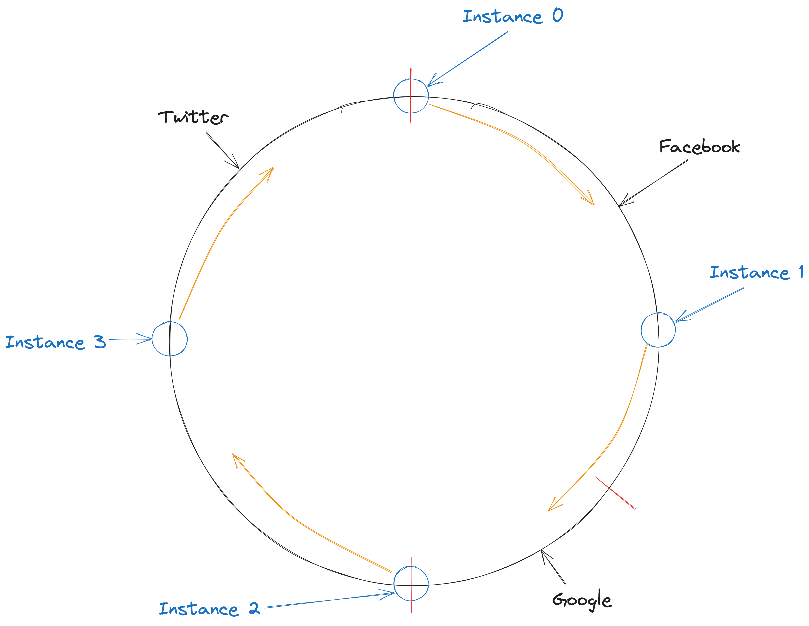
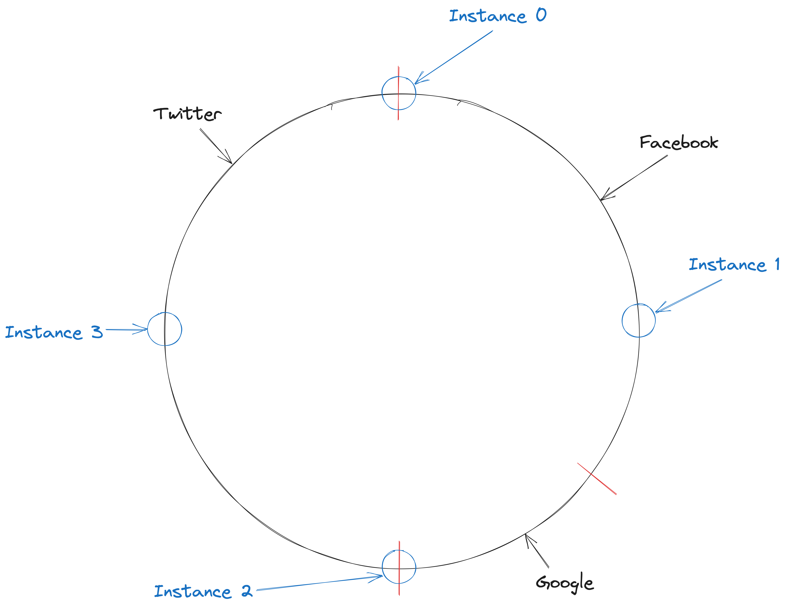

## Introduction
In today's dynamic digital landscape, efficient request routing is paramount for ensuring optimal performance and 
user experience. As businesses grow and diversify their online services, the need for a more refined, percentage-based 
request routing system becomes evident. Such a system can be instrumental in balancing payment requests, especially when
dealing with multiple payment providers that have varying cost structures. But how can we design a system that routes
thousands of requests per second based on predefined percentages without compromising on performance? Moreover, 
how can we ensure that this system is scalable and distributed to meet the demands of a rapidly evolving digital 
ecosystem? In this blog post, we delve deep into two potential solutions to this intriguing challenge: 
the Atomic Redis Counter and the Ring Buffer with Service Discovery. Join us as we dissect each approach,
weighing their pros and cons, and provide insights into which might be the best fit for your specific needs.

## Problem Statement
We want the ability to route requests to different gateways based on a percentage.
This system does not need to be 100% accurate when routing requests.

Here is an example configuration:

| Route    | Percentage |
|----------|------------|
| Twitter  | 50%        |
| Google   | 20%        |
| Facebook | 30%        |

In a real world situation this would most likely be used for percentage routing and balancing of payment requests,
certain payment providers charge more per request once a specific threshold is met. A percentage based load balancer
could prevent these thresholds from being met. 

To help conceptualise the requirements we can say we have **3000 requests per second**, all of which need to be routed
based on this percentage.

**How can we effectively implement a system to ensure all requests are routed based on their percentage without impacting
performance while also ensuring the system is highly distributed and scalable?**

## Possible Solution - Atomic Redis Counter:

A potential answer to this question could be an atomic counter using Redis.

The counter would start at 1 and go to 100, as requests come in each service would lock the key / value pair in Redis,
read the value and update the counter.

The value would then determine which gateway to send the request to, for example:

```java
// Increment the counter atomically
long counter = jedis.incr("request_counter");

// If counter exceeds 100, reset it to 1
if (counter > 100) {
    jedis.set("request_counter", "1");
    counter = 1;
}

// Determine the gateway based on the counter value
if (counter <= 50) {
    return "Twitter";
} else if (counter <= 70) {  // 50 + 20 = 70
    return "Google";
} else {
    return "Facebook";
}  
```

While this does work, it does come with some concerns, especially seeming as our requirements requiring 3000
requests per second. Below I have listed a handful of issues with this design. 

### Concerns with this approach:

1. **Scalability:** 
   1. **Single Point of Bottleneck:** Since all requests need to interact with the Redis instance to get the counter value, it can become a bottleneck when there's a high volume of requests. Even though Redis is fast, the sheer number of operations (increment and possibly reset) can strain the system.
   2. **Network Latency:** If the application instances are not co-located with the Redis instance, network latency can introduce delays in request routing.
2. **Possibility to block other instances / servers:**
   1. **Lock Contention:** If multiple instances try to reset the counter simultaneously after it exceeds 100, there can be contention. While Redis operations like INCR are atomic, the check-and-set pattern (checking if the counter is over 100 and then resetting it) is not inherently atomic and can lead to race conditions.
   2. **Blocking Delays:** If one instance takes longer to interact with Redis (due to network issues, for instance), it might delay other instances from accessing the counter, leading to uneven distribution or potential timeouts. 
3. **Possible Cascading Failures:**
   1. **Cascade Failures:** If the Redis instance becomes unresponsive or slow (due to high CPU usage, memory issues, etc.), it can cause the application instances to become slow or unresponsive as they wait for Redis. This can lead to a cascading failure where one component's failure leads to system-wide degradation or outage.
   2. **Single Point of Failure:** If the Redis instance goes down, the entire request routing mechanism breaks. Even with Redis replication, there's a period of time during failover where the system might not function as expected.
   3. **Thread Blocking:** Since Redis is single-threaded, long-running commands or a large number of simultaneous commands can block the server, causing delays. If our application instance is also single-threaded, it can get blocked waiting for Redis, leading to potential deadlocks or severe performance degradation.

## Possible Solution - Ring Buffer with Service Discovery:

The code shown here in snippets can be found in this [GitHub Gist](https://gist.github.com/CameronMukherjee/2113089096a5d17e1dab2e5c36947a4b).

A more scalable solution to this issue (with additional overhead) would be implementing service discovery for each node
and maintain a local copy of a Ring Buffer.

The ring buffer would be 100 elements long, representing the percentage distribution for routing.

### We start with an array of 100 values
0 to 99 - this will be used to represent the percentage routing


### The array is attached to itself in the following fashion, forming a ring
This is commonly known as a ring buffer, circular buffer or cyclic buffer:


### We can now plot our percentage based routing into the ring in the following fashion


This is an example of what the underlying array would look like:
```python
# 50 Twitters, 30 Facebooks, 20 Googles
[https://www.twitter.com, https://www.twitter.com, https://www.twitter.com, https://www.twitter.com, https://www.twitter.com, https://www.twitter.com, https://www.twitter.com, https://www.twitter.com, https://www.twitter.com, https://www.twitter.com, https://www.twitter.com, https://www.twitter.com, https://www.twitter.com, https://www.twitter.com, https://www.twitter.com, https://www.twitter.com, https://www.twitter.com, https://www.twitter.com, https://www.twitter.com, https://www.twitter.com, https://www.twitter.com, https://www.twitter.com, https://www.twitter.com, https://www.twitter.com, https://www.twitter.com, https://www.twitter.com, https://www.twitter.com, https://www.twitter.com, https://www.twitter.com, https://www.twitter.com, https://www.twitter.com, https://www.twitter.com, https://www.twitter.com, https://www.twitter.com, https://www.twitter.com, https://www.twitter.com, https://www.twitter.com, https://www.twitter.com, https://www.twitter.com, https://www.twitter.com, https://www.twitter.com, https://www.twitter.com, https://www.twitter.com, https://www.twitter.com, https://www.twitter.com, https://www.twitter.com, https://www.twitter.com, https://www.twitter.com, https://www.twitter.com, https://www.twitter.com, https://www.facebook.com, https://www.facebook.com, https://www.facebook.com, https://www.facebook.com, https://www.facebook.com, https://www.facebook.com, https://www.facebook.com, https://www.facebook.com, https://www.facebook.com, https://www.facebook.com, https://www.facebook.com, https://www.facebook.com, https://www.facebook.com, https://www.facebook.com, https://www.facebook.com, https://www.facebook.com, https://www.facebook.com, https://www.facebook.com, https://www.facebook.com, https://www.facebook.com, https://www.facebook.com, https://www.facebook.com, https://www.facebook.com, https://www.facebook.com, https://www.facebook.com, https://www.facebook.com, https://www.facebook.com, https://www.facebook.com, https://www.facebook.com, https://www.facebook.com, https://www.google.com, https://www.google.com, https://www.google.com, https://www.google.com, https://www.google.com, https://www.google.com, https://www.google.com, https://www.google.com, https://www.google.com, https://www.google.com, https://www.google.com, https://www.google.com, https://www.google.com, https://www.google.com, https://www.google.com, https://www.google.com, https://www.google.com, https://www.google.com, https://www.google.com, https://www.google.com]
```
 
### Plot our server pointers onto the ring:
We can now create our pointers for each server / instance, and balance them across the ring buffer.
We would utilise a distribution coordination tool like Apache ZooKeeper for this part.  Apache ZooKeeper will give us
the ability to find out how many instances of _this_ server is online, allowing us to distribute tasks across the instances.


Figuring out the pointer location is very easy and looks something like this:

```java
private void updateRingPointer() {
  int partitionSize = 100 / getInstancesAvailable();
  this.pointer = getInstanceNumber() * partitionSize;
  log.info("Instance pointer has been changed to: [{}]", this.pointer);
}
```
Each service would be responsible for resolving their own pointer.

### How do I use this in my implementation?

**Important Note:** When a request hits our service we first make sure the requests are load balanced via Round Robin, any non-sequential / cyclic
load balancing strategy will result with this not working, for example hash based routing, or sticky routing.

1. Firstly, our server instance registers with Apache ZooKeeper and finds out where there pointer is via the following code:
```java
public int getInstancesAvailable() throws InterruptedException, KeeperException {
  List<String> activeInstances = zooKeeper.getChildren(serverInstancePath, this);

  return activeInstances.size();
}

public int getInstanceNumber() throws InterruptedException, KeeperException {
  List<String> activeInstances = zooKeeper.getChildren(serverInstancePath, this);
  return activeInstances.indexOf(instanceName);
}

private void updateRingPointer() {
  int partitionSize = 100 / getInstancesAvailable();
  this.pointer = getInstanceNumber() * partitionSize;
  log.info("Instance pointer has been changed to: [{}]", this.pointer);
}
```
2. When a new request lands on our service we can convert our configuration to the ring buffer (code omitted as it's highly dependent on your domain objects) - please make sure it builds in the same order for all instances (have some sorting involved).
3. We fetch the pointer (which has been previously updated by our `updateRingPointer()` function): 
```java
public int getAndIncrementPointer() {
  int currentPointer = this.pointer;
  if (currentPointer + 1 >= 100) {
      this.pointer = 0;
  } else {
      this.pointer++;
  }

  return currentPointer;
}
```
3. We can then index into the array at that value and route the request based on the value.
4. If an error occurs you can decrement the pointer by 1 (if value is at 0 then return 100) to ensure you maintain a consistent balance between all nodes. 

Here is what this looks like across 4 different services:


- The first request lands on `Instance 0` and moves the pointer forward by 1.
- The second request lands on `Instance 1` and moves the pointer forward by 1.
- The third request lands on `Instance 2` and moves the pointer forward by 1.
- The fourth request lands on `Instance 3` and moves the pointer forward by 1.
- The fifth request lands on `Instance 0` and moves the pointer forward by 1.

**When any pointer reaches 100 they are reset to 0.**

### What about scaling up and down?

Instances will receive an event from Apache ZooKeeper stating that children have changed, allowing you to re-run the 
`updateRingPointer()` function provided above, providing the new pointer location.

So, what if 4 instances are now available (we've scaled up)?

The ring buffer pointers would be updated to the following, 
as you can see, all pointers have been moved evenly apart to ensure a correct balance when receiving the next set of 
requests.

Here are some examples of what the pointers would look like based on how many instances are available:

**4 Instances:**
| Instance Number | Pointer |
|-----------------|----|
| 0               | 0  |
| 1               | 25 |
| 2               | 50 |
| 3               | 75 |

**3 Instances:**
| Instance Number | Pointer |
|-----------------|---------|
| 0               | 0       |
| 1               | 33      |
| 2               | 66      |

Keep in mind, everytime an instance is added or removed these pointers are reset to a default position to ensure
equal balancing. 
For example, this means if `Instance 0` has moved forward 10 paces but a new instance comes online, the pointer is reset
to 0 - meaning the next 10 requests will be duplicated (based on current implementation - something I would like to fix
moving forward).

### Advantages of this approach
1. No usage of Redis to maintain a counter, removing the possibility of thread deprivation or single point of failure.
2. Low memory footprint if we use String values in the ring buffer (in Java, the String pool will be used for storing each gateway config).
3. Faster lookup as array has already been build / cached on the instance (O(1) look up).
4. Highly scalable as new nodes can join and leave the cluster without introducing any locks on shared state. 

### Concerns with this approach
1. If nodes are added and removed from the cluster frequently, this will not work effectively, re-balancing will cause all pointers to be rebalanced and thus reset to a default equally partitioned state.
2. Additional code complexity and new service introduction (Apache ZooKeeper).
3. Overhead from building the Ring Buffer (can be cached within the instance to lower the overhead - this comes with its own downfalls though).

### Future Improvement
1. Instead of maintaining one pointer per service, we can maintain multiple (acting as virtual pointers), which allows for a much more even distribution.
2. Ability to add and remove nodes without moving current in use pointers - allowing for re-balancing to not affect the currently processed distribution.

## Conclusion
Software architecture is a vast and intricate domain, where one-size-fits-all solutions are a rarity. The challenge of routing requests based on percentages, particularly at high volumes, epitomizes this complexity. In our exploration, we delved into two promising solutions: the Atomic Redis Counter and the Ring Buffer with Service Discovery.

The Atomic Redis Counter stands out for its straightforwardness. It's a solution that can be quickly implemented and understood. However, its simplicity can be a double-edged sword when scalability comes into play. For systems that don't anticipate a surge in traffic or those in their nascent stages, this might be an ideal choice.

On the other hand, the Ring Buffer with Service Discovery is a testament to the power of modern distributed systems. While it demands a deeper understanding and more intricate setup, it shines in scenarios where scalability and distributed processing are paramount. Systems that are poised for growth or those already experiencing high traffic volumes might find this approach more in line with their needs.

Yet, it's crucial to remember that the world of software is teeming with possibilities. The strategies discussed here are but a drop in the ocean of potential solutions. The right approach hinges heavily on the unique challenges and requirements of your system. It's not about finding the "best" solution in a general sense, but rather the most fitting one for your specific context.

Moreover, the technological landscape is in a state of perpetual flux. Today's cutting-edge solution might become tomorrow's legacy system. As architects and developers, it's our responsibility to stay abreast of emerging tools and techniques. Regular evaluations, performance monitoring, and a willingness to pivot when necessary are essential.

In wrapping up, percentage-based request routing, though a nuanced problem, offers a myriad of solutions. The essence lies in comprehending your system's intricacies, forecasting potential hurdles, and opting for a solution that strikes the right chord between simplicity, scalability, and efficacy. In the realm of software, the optimal solution is invariably tailored to your unique challenges and aspirations.

[GitHub Gist](https://gist.github.com/CameronMukherjee/2113089096a5d17e1dab2e5c36947a4b) related to this project.